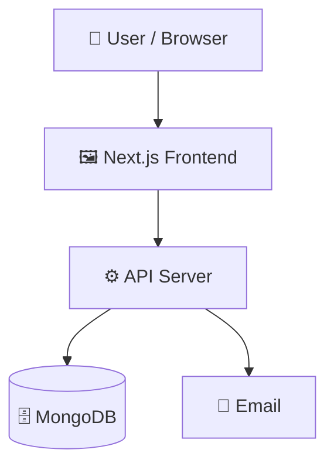

# acedemiaOS

   

## 📑 Table of Contents

- [Description](#description)
- [Tech Stack](#tech-stack)
- [Architecture](#architecture)
- [Quick Start](#quick-start)
- [Key Dependencies](#key-dependencies)
- [Available Scripts](#available-scripts)
- [API Endpoints](#api-endpoints)
- [Project Structure](#project-structure)
- [Development Setup](#development-setup)
- [Contributors](#contributors)
- [Contributing](#contributing)

## 📝 Description

An organised Learning management system

## 🛠️ Tech Stack

   

**Notable libraries:** Mongoose, Nodemailer, Zod

## 🏗️ Architecture

A high-level view of how the main pieces fit together:



## ⚡ Quick Start

```bash

# 1. Clone the repository
git clone https://github.com/adityakumar841208/acedemiaOS.git

# 2. Install dependencies
npm install

# 3. Start the dev server
npm run dev
```

## 📦 Key Dependencies

```
@base-ui/react: ^1.8.0
@types/canvas-confetti: ^1.9.0
@xyflow/react: ^12.11.6
bcryptjs: ^3.0.3
canvas-confetti: ^1.9.4
class-variance-authority: ^0.7.1
clsx: ^2.1.1
cn: ^0.4.0
geist: ^1.7.2
jose: ^6.2.12
lucide-react: ^1.47.0
mongoose: ^9.10.1
next: 15.5.25
nodemailer: ^10.0.10
react: 19.1.0
```

## 🚀 Available Scripts

- **dev** — `npm run dev`
- **build** — `npm run build`
- **start** — `npm run start`
- **lint** — `npm run lint`
- **seed** — `npm run seed`
- **seed:admin** — `npm run seed:admin`
- **seed:demo** — `npm run seed:demo`

## 🌐 API Endpoints

Detected endpoints (best-effort scan):

```
/api/announcements/[id]/telegram
/api/announcements
/api/assignments/[id]
/api/assignments/[id]/submit
/api/assignments
/api/auth/approvals
/api/auth/forgot-password
/api/auth/login
/api/auth/logout
/api/auth/me
/api/auth/profile
/api/auth/register
/api/auth/reset-password
/api/notifications
/api/resources/[id]/download
/api/resources
/api/seed
/api/subjects/[id]
/api/subjects
/api/submissions/[id]/grade
```

## 📁 Project Structure

```
.
├── app
│   ├── (dashboard)
│   │   ├── admin
│   │   │   └── page.tsx
│   │   ├── announcements
│   │   │   └── page.tsx
│   │   ├── assignments
│   │   │   ├── [id]
│   │   │   │   └── page.tsx
│   │   │   └── page.tsx
│   │   ├── cr
│   │   │   ├── announcements
│   │   │   │   └── page.tsx
│   │   │   └── page.tsx
│   │   ├── dashboard
│   │   │   └── page.tsx
│   │   ├── faculty
│   │   │   ├── assignments
│   │   │   │   └── page.tsx
│   │   │   ├── page.tsx
│   │   │   └── submissions
│   │   │       ├── [id]
│   │   │       │   └── ...
│   │   │       └── page.tsx
│   │   ├── layout.tsx
│   │   ├── profile
│   │   │   └── page.tsx
│   │   ├── resources
│   │   │   ├── [id]
│   │   │   │   └── page.tsx
│   │   │   └── page.tsx
│   │   └── subjects
│   │       ├── [id]
│   │       │   └── page.tsx
│   │       └── page.tsx
│   ├── about
│   │   └── page.tsx
│   ├── api
│   │   ├── announcements
│   │   │   ├── [id]
│   │   │   │   └── telegram
│   │   │   │       └── ...
│   │   │   └── route.ts
│   │   ├── assignments
│   │   │   ├── [id]
│   │   │   │   ├── route.ts
│   │   │   │   └── submit
│   │   │   │       └── ...
│   │   │   └── route.ts
│   │   ├── auth
│   │   │   ├── approvals
│   │   │   │   └── route.ts
│   │   │   ├── forgot-password
│   │   │   │   └── route.ts
│   │   │   ├── login
│   │   │   │   └── route.ts
│   │   │   ├── logout
│   │   │   │   └── route.ts
│   │   │   ├── me
│   │   │   │   └── route.ts
│   │   │   ├── profile
│   │   │   │   └── route.ts
│   │   │   ├── register
│   │   │   │   └── route.ts
│   │   │   └── reset-password
│   │   │       └── route.ts
│   │   ├── notifications
│   │   │   └── route.ts
│   │   ├── resources
│   │   │   ├── [id]
│   │   │   │   └── download
│   │   │   │       └── ...
│   │   │   └── route.ts
│   │   ├── seed
│   │   │   └── route.ts
│   │   ├── subjects
│   │   │   ├── [id]
│   │   │   │   └── route.ts
│   │   │   └── route.ts
│   │   └── submissions
│   │       ├── [id]
│   │       │   └── grade
│   │       │       └── ...
│   │       └── route.ts
│   ├── contact
│   │   └── page.tsx
│   ├── favicon.ico
│   ├── forgot-password
│   │   └── page.tsx
│   ├── globals.css
│   ├── layout.tsx
│   ├── login
│   │   └── page.tsx
│   ├── page.tsx
│   ├── register
│   │   └── page.tsx
│   ├── registration-pending
│   │   └── page.tsx
│   └── reset-password
│       └── page.tsx
├── components
│   ├── announcements
│   │   ├── AnnouncementCard.tsx
│   │   └── AnnouncementComposer.tsx
│   ├── assignments
│   │   ├── AssignmentCard.tsx
│   │   ├── DeadlineCountdown.tsx
│   │   ├── SimilarityBadge.tsx
│   │   └── SimilarityDetailModal.tsx
│   ├── auth
│   │   └── PendingStudentApprovals.tsx
│   ├── layout
│   │   ├── Navbar.tsx
│   │   ├── PublicFooter.tsx
│   │   ├── Sidebar.tsx
│   │   └── TelegramJoinButton.tsx
│   ├── resources
│   │   ├── PDFPreviewModal.tsx
│   │   ├── ResourceCard.tsx
│   │   └── ResourceUploaderModal.tsx
│   ├── subjects
│   │   └── SyllabusEditorModal.tsx
│   ├── ui
│   │   └── hexagon-pattern.tsx
│   └── vault
│       ├── ResourceBreadcrumb.tsx
│       ├── ResourceListView.tsx
│       ├── ResourceToolbar.tsx
│       ├── ResourceVaultCanvas.tsx
│       └── nodes
│           ├── DepartmentNode.tsx
│           ├── ModuleNode.tsx
│           ├── ResourceNode.tsx
│           ├── ResourceTypeNode.tsx
│           ├── SemesterNode.tsx
│           └── SubjectNode.tsx
├── components.json
├── context
│   └── UserContext.tsx
├── eslint.config.mjs
├── lib
│   ├── auth.ts
│   ├── db.ts
│   ├── email.ts
│   ├── integrations
│   │   └── telegram
│   │       ├── client.ts
│   │       ├── messages.ts
│   │       └── types.ts
│   ├── mock-data.ts
│   ├── permissions.ts
│   ├── personas.ts
│   ├── resource-vault-data.ts
│   ├── services
│   │   ├── notification.service.ts
│   │   ├── similarity.service.ts
│   │   └── telegram.service.ts
│   ├── store.ts
│   ├── utils.ts
│   └── vault-layout.ts
├── middleware.ts
├── models
│   ├── Assignment.ts
│   ├── Notification.ts
│   ├── Resource.ts
│   ├── Subject.ts
│   └── User.ts
├── next.config.ts
├── package.json
├── postcss.config.mjs
├── public
│   ├── file.svg
│   ├── globe.svg
│   ├── next.svg
│   ├── vercel.svg
│   └── window.svg
├── scripts
│   ├── apply-all-changes.js
│   ├── apply-frontend-pages.js
│   ├── fix-submission-errors.js
│   ├── seed.ts
│   ├── test-assignment-flow.ts
│   ├── test-cr-syllabus.ts
│   ├── test-faculty-submission-page.js
│   ├── test-faculty-submission-page.ts
│   ├── test-full-workflow.ts
│   ├── verify-e2e.ts
│   └── verify-vault.ts
├── todo
├── tsconfig.json
└── types
    ├── index.ts
    ├── styles.d.ts
    └── vault.ts
```

## 🛠️ Development Setup

### Node.js / JavaScript
1. Install Node.js (v18+ recommended)
2. Install dependencies: `npm install` (or `yarn` / `pnpm install` / `bun install`)
3. Start the dev server: see the **Quick Start** above

## 👥 Contributors

Thanks to everyone who has contributed to this project:

<p align="left">
<a href="https://github.com/adityadam2005" title="adityadam2005"></a>
</p>

[See the full list of contributors →](https://github.com/adityakumar841208/acedemiaOS/graphs/contributors)

## 👥 Contributing

Contributions are welcome! Here's the standard flow:

1. **Fork** the repository
2. **Clone** your fork: `git clone https://github.com/adityakumar841208/acedemiaOS.git`
3. **Branch**: `git checkout -b feature/your-feature`
4. **Commit**: `git commit -m 'feat: add some feature'`
5. **Push**: `git push origin feature/your-feature`
6. **Open** a pull request

Please follow the existing code style and include tests for new behavior where applicable.

---
